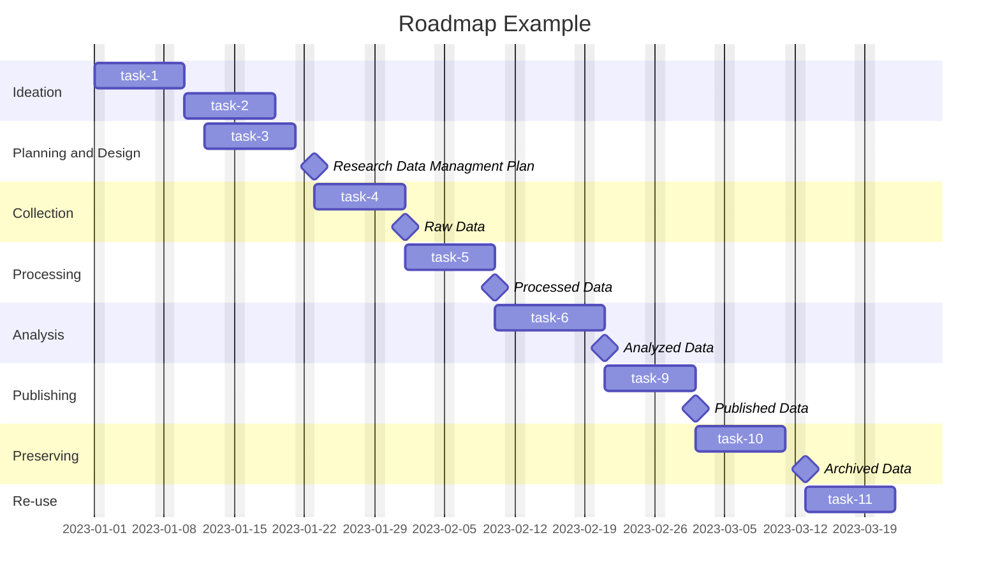

# Project Title

Write a brief overview that lightly touches on your project's:

- Vision
- Goals
- Target audience

## Table of Contents

- [Table of Contents](#table-of-contents)
- [About](#about)
- [Roadmap](#roadmap)
- [Team/Acknowlegements](#teamacknowlegements)
- [Contributing](#contributing)
- [Reproducing](#reproducing)
- [Repository Structure](#repository-structure)

## About

Provide greater detail about the project here or provide references to links elsewhere within the repo

- [Proposal](docs/project/proposal.md)
- [Progress](docs/project/progress.md)

## Roadmap

You can produce a graphical roadmap of your project with [Mermaid](https://docs.github.com/en/get-started/writing-on-github/working-with-advanced-formatting/creating-diagrams). Alternatively writing it out in a `ROADMAP.md` file works just as well.



## Team/Acknowlegements
Include any identified subject matter experts that helped in the development and delivery of your project.

## Contributing

If you are collaborating with others it's best to establish some ground rules through a `CONTRIBUTING.md` file in your projects's root.

## Reproducing
To make the most out of your repository provide guidance that enables others to reproduce your workflow.

### Run Locally
### Run on the SCC


## Repository Structure

```bash
project-structure
├── .gitignore            # <-- Files and directories for git to ignore
├── code
│   ├── analysis    # <-- Code for performing analyses
│   ├── data        # <-- Code for moving data from {source}->{bronze}->{silver}->{gold}
│   ├── figures     # <-- Code for producing figures
│   └── job         # <-- Code for job submissions
├── data            
│   ├── bronze      # <-- Original immutable data
│   ├── silver      # <-- Preprocessed data for modeling and analyses
│   └── gold        # <-- Aggregate data, outputs from models and analyses
├── docs
│   ├── code        # <-- Documentation for code
│   ├── data        # <-- Documentation for datasets (i.e. metadata, data dictionaries)
│   │   ├── bronze
│   │   ├── silver
│   │   └── gold
│   ├── external    # <-- Documentation from external sources 
│   └── project     # <-- Documentation for project (i.e Research Data Management Plan)
├── environments    # <-- Environments used with project (i.e. .env, environment.yml)
├── figures
├── lib             # <-- External libraries needed to run your code
├── models          # <-- Trained and serialized models, model predictions, or model summaries
├── notebooks       # <-- Notebooks used in exploratory data analysis, numbered in order
├── README.md       # <-- Overview of your project
├── CONTRIBUTING.md # <-- How to contribute to developing this template
└── Makefile        # <-- Contains custom commands to execute your project 
```